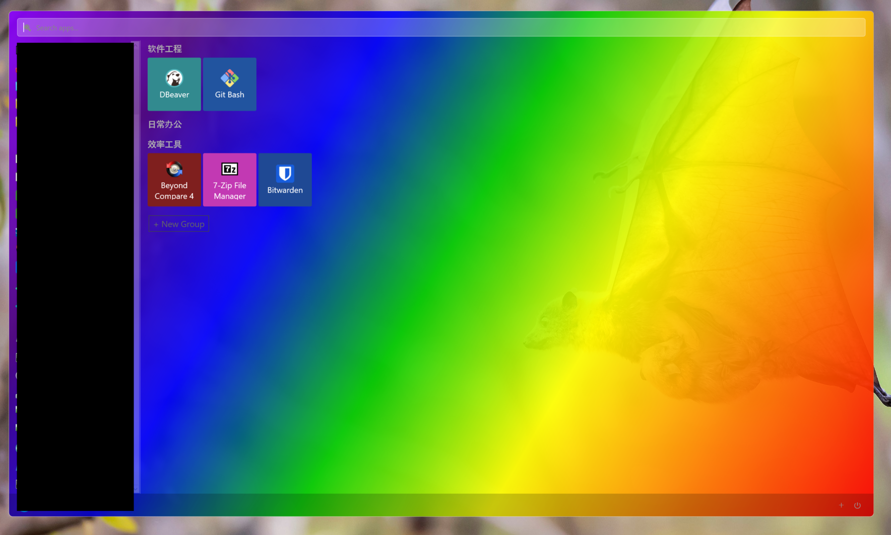

# WinXStart

[English](README.md)

受够了 Windows 11 的开始菜单？试试这个。  
**WinXStart** 是一款轻量级的 Windows 10 风格磁贴开始菜单，使用 WPF 构建，完全可自定义。  
随时按下 **Win + Alt + Z** 即可呼出。



## 功能特性

- **全局热键** — `Win+Alt+Z` 随时呼出/隐藏
- **自动扫描** — 自动发现开始菜单中已安装的应用
- **磁贴分组** — 将应用固定为可调大小的磁贴，按自定义分组整理
- **拖拽排序** — 在分组内或跨分组拖拽调整顺序
- **磁贴大小** — 每个磁贴可选 小 / 中 / 大
- **即时搜索** — 输入即过滤
- **文件固定** — 右键可直接固定任意 `.exe` 或 `.lnk` 文件
- **系统托盘** — 安静地待在通知区域，双击打开
- **开机自启** — 可选的 Windows 启动项
- **完全自定义** — 编辑 `settings.json` 自定义渐变色、透明度、边框、字体等

## 系统要求

- Windows 10 / 11
- [.NET 10 SDK](https://dotnet.microsoft.com/download/dotnet/10.0)（或更高版本）

## 构建与运行

```bash
dotnet build
dotnet run
```

## 配置

首次启动后会在可执行文件旁生成 `settings.json`。  
可通过托盘图标 → **Open Settings** 打开，也可手动编辑：

```jsonc
{
  "WindowSizePercent": 70,       // 窗口大小占屏幕百分比 (10–100)
  "Opacity": 80,                 // 背景不透明度 (0–100)
  "GradientColors": [            // 任意数量的渐变色
    "#FF0000", "#FF7700", "#FFFF00",
    "#00CC00", "#0000FF", "#4B0082", "#8B00FF"
  ],
  "GradientDirection": "Diagonal", // Diagonal / Horizontal / Vertical
  "CornerRadius": 8,
  "BorderColor": "#66FFFFFF",
  "TileFontSize": 12,
  "GroupFontSize": 13
}
```

修改后重启应用即可生效。

## 技术栈

| 层级 | 技术 |
|------|------|
| UI | WPF (XAML + C#) |
| 运行时 | .NET 10 |
| 架构 | MVVM (ViewModelBase, RelayCommand) |
| 热键 | Win32 `RegisterHotKey` (P/Invoke) |
| 托盘 | WinForms `NotifyIcon` |
| 持久化 | JSON (System.Text.Json) |

## 许可证

MIT
